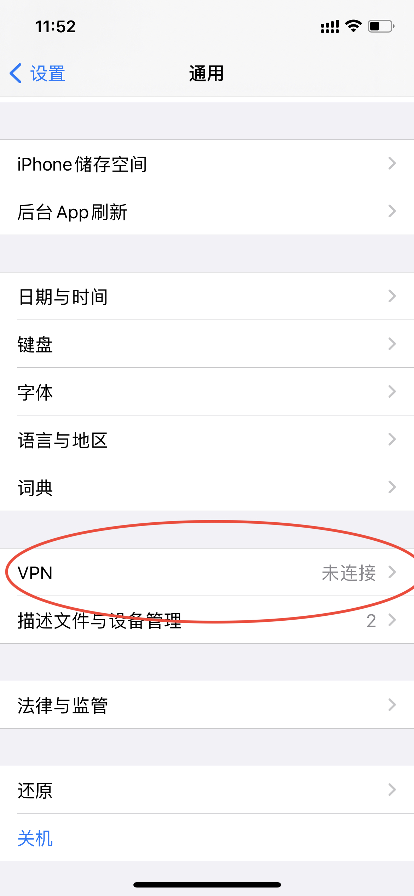

# IOS 连接VPN

## 生成的VPN账号示例

```text
Trying to auto discover IP of this server...

Starting IPsec service...

================================================

IPsec VPN server is now ready for use!

Connect to your new VPN with these details:

Server IP: 54.92.87.72
IPsec PSK: vpn_user_psk
Username: vpn_user
Password: vpn_user_pwd

Write these down. You'll need them to connect!

VPN client setup: https://vpnsetup.net/clients2

================================================

Setting up IKEv2. This may take a few moments...

================================================

IKEv2 setup successful. Details for IKEv2 mode:

VPN server address: 54.92.87.72
VPN client name: vpnclient

Client configuration is available inside the
Docker container at:
/etc/ipsec.d/vpnclient.p12 (for Windows & Linux)
/etc/ipsec.d/vpnclient.sswan (for Android)
/etc/ipsec.d/vpnclient.mobileconfig (for iOS & macOS)

Next steps: Configure IKEv2 clients. See:
https://vpnsetup.net/clients2

================================================
```

## 连接VPN

### L2TP/IPSec

进入设置 -> 通用 -> VPN。  

单击 添加VPN配置。  
单击 类型 。选择 L2TP 并返回。  
在 描述 字段中输入任意内容。  
在 服务器 字段中输入你的 VPN 服务器 IP。  
在 帐户 字段中输入你的 VPN 用户名。  
在 密码 字段中输入你的 VPN 密码。  
在 密钥 字段中输入你的 VPN IPsec PSK。  
启用 发送所有流量 选项。  
单击右上角的 完成。  

启用 VPN 连接。  

