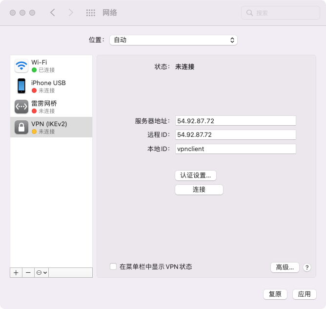

# MacOS 连接VPN

## 生成的VPN账号示例

```text
Trying to auto discover IP of this server...

Starting IPsec service...

================================================

IPsec VPN server is now ready for use!

Connect to your new VPN with these details:

Server IP: 54.92.87.72
IPsec PSK: vpn_user_psk
Username: vpn_user
Password: vpn_user_pwd

Write these down. You'll need them to connect!

VPN client setup: https://vpnsetup.net/clients2

================================================

Setting up IKEv2. This may take a few moments...

================================================

IKEv2 setup successful. Details for IKEv2 mode:

VPN server address: 54.92.87.72
VPN client name: vpnclient

Client configuration is available inside the
Docker container at:
/etc/ipsec.d/vpnclient.p12 (for Windows & Linux)
/etc/ipsec.d/vpnclient.sswan (for Android)
/etc/ipsec.d/vpnclient.mobileconfig (for iOS & macOS)

Next steps: Configure IKEv2 clients. See:
https://vpnsetup.net/clients2

================================================
```

## 连接VPN

提供两种方式连接VPN，分别为L2TP/IPSec和IKEv2，你可以任选其一连接。

### L2TP/IPSec

打开系统偏好设置并转到网络部分。


在窗口左下角单击 + 按钮。


从 接口 下拉菜单选择 VPN。 从 VPN类型 下拉菜单选择 IPSec 上的 L2TP。 在 服务名称 字段中输入任意内容。 单击 创建。


在 服务器地址 字段中输入你的 VPN 服务器 IP。
在 帐户名称 字段中输入你的 VPN 用户名。


单击 认证设置 按钮。
在 用户认证 部分，选择 密码 单选按钮，然后输入你的 VPN 密码。
在 机器认证 部分，选择 共享的密钥 单选按钮，然后输入你的 VPN IPsec PSK。
保持 群组名称 字段空白。
单击 好。


选中 在菜单栏中显示 VPN 状态 复选框。
（重要） 单击 高级 按钮，并选中 通过VPN连接发送所有通信 复选框。
（重要） 单击 TCP/IP 选项卡，并在 配置IPv6 部分中选择 仅本地链接。


单击 好 关闭高级设置，然后单击 应用 保存VPN连接信息。  
单击 连接


### IKEv2

生成的 .mobileconfig 文件安全地传送到你的 Mac，然后双击并按提示操作。  
打开系统偏好设置并转到描述文件部分以完成导入。


打开系统偏好设置并转到网络部分。


在窗口左下角单击 + 按钮。


从 接口 下拉菜单选择 VPN。 从 VPN 类型 下拉菜单选择 IKEv2。 在 服务名称 字段中输入任意内容。 单击 创建。


在 服务器地址 字段中输入 你的 VPN 服务器 IP （或者域名）。  
注： 如果你在配置 IKEv2 时指定了服务器的域名（而不是 IP 地址），则必须在 服务器地址 和 远程 ID 字段中输入该域名。  
在 远程 ID 字段中输入 你的 VPN 服务器 IP （或者域名）。  
在 本地 ID 字段中输入 你的 VPN 客户端名称。  
注： 该名称必须和你在 IKEv2 配置过程中指定的客户端名称一致。它与你的 .p12 文件名的第一部分相同。    


单击 认证设置 按钮。
从 认证设置 下拉菜单中选择 无。
选择 证书 单选按钮，然后选择新的客户端证书。
单击 好。


选中 在菜单栏中显示 VPN 状态 复选框。
单击 应用 保存VPN连接信息。


单击 连接
