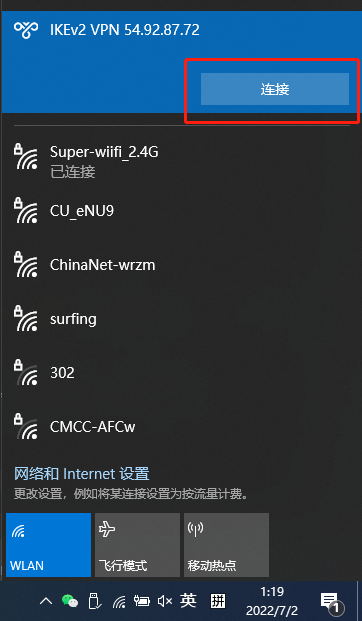

# Windows10 连接VPN

## 生成的VPN账号示例

<details>
<summary>
点击展开查看
</summary>

```text
Trying to auto discover IP of this server...

Starting IPsec service...

================================================

IPsec VPN server is now ready for use!

Connect to your new VPN with these details:

Server IP: 54.92.87.72
IPsec PSK: vpn_user_psk
Username: vpn_user
Password: vpn_user_pwd

Write these down. You'll need them to connect!

VPN client setup: https://vpnsetup.net/clients2

================================================

Setting up IKEv2. This may take a few moments...

================================================

IKEv2 setup successful. Details for IKEv2 mode:

VPN server address: 54.92.87.72
VPN client name: vpnclient

Client configuration is available inside the
Docker container at:
/etc/ipsec.d/vpnclient.p12 (for Windows & Linux)
/etc/ipsec.d/vpnclient.sswan (for Android)
/etc/ipsec.d/vpnclient.mobileconfig (for iOS & macOS)

Next steps: Configure IKEv2 clients. See:
https://vpnsetup.net/clients2

================================================
```
</details>

## 连接步骤演示

提供两种方式连接VPN，分别为L2TP/IPSec和IKEv2，你可以任选其一连接。

### L2TP/IPSec

单击系统托盘中的无线/网络图标。


点击 VPN，点击添加VPN。  
VPN服务商：选择Windows(内置)。  
连接名称：没有要求，你可以随便起一个名字。  
服务器名称或地址：填写VPN服务器的IP。  
VPN类型：使用预共享密钥的L2TP/IPsec。  
预共享密钥：填写VPN的IPsec PSK。  
登录信息的类型：用户名和密码。  
用户名：填写VPN的账号。  
密码：填写VPN的密码。  


单击系统托盘中的无线/网络图标，连接VPN。


查看是否连接成功。


### IKEv2

Windows 8, 10 和 11 用户可以自动导入 IKEv2 配置  
  
将生成的 .p12 文件安全地传送到你的计算机。  
右键单击 [ikev2_config_import.cmd](assets/windows.cmd/ikev2_config_import.cmd) 并保存这个辅助脚本到与 .p12 文件 相同的文件夹。  
右键单击cmd脚本，选择 属性。单击对话框下方的 解除锁定，然后单击 确定。  
右键单击cmd脚本，选择 以管理员身份运行 并按提示操作。  
在整个配置过程中，在提示 `VPN server address:` 的时候，需要你输入VPN服务器的IP地址，其他的都是回车，使用默认配置即可。  


单击系统托盘中的无线/网络图标，连接VPN。



查看是否连接成功。

