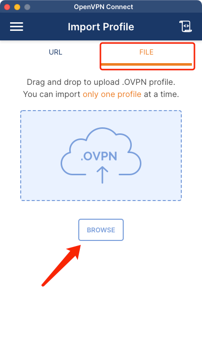
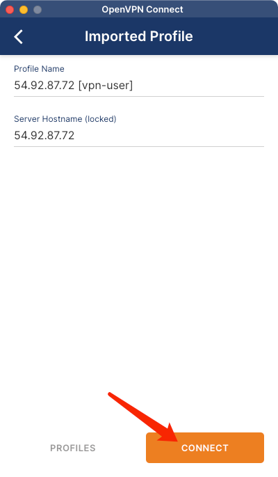
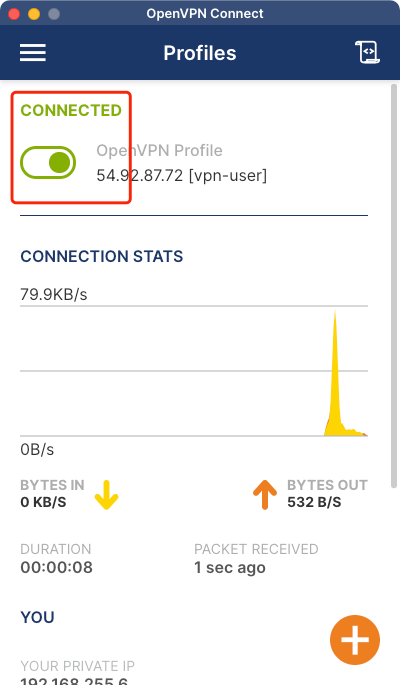

# OpenVPN客户端连接VPN

当你的设备安装好 [OpenVPN](https://openvpn.net/vpn-client) 软件后，只需要两步，即可快速连接VPN。

## 下载OpenVPN客户端

- 官网下载：https://openvpn.net/vpn-client
- 百度云下载(推荐)：https://pan.baidu.com/s/1XTuy_Tpe2C2LS6T9Bolrmg?pwd=qr7p
- Gitee下载：https://gitee.com/code_soft/science-net/tree/master/open-x
- 蓝奏云下载：https://wwd.lanzouw.com/b03j3402h 密码:fity

## 连接步骤演示

打开 OpenVPN 软件，选择 `FILE`，然后点击 `BROWSE` 浏览文件，导入 `xxx.ovpn` 文件。

点击 `CONNECT` 进行连接

如果 `CONNECT` 变成绿色，则表示VPN连接成功。

