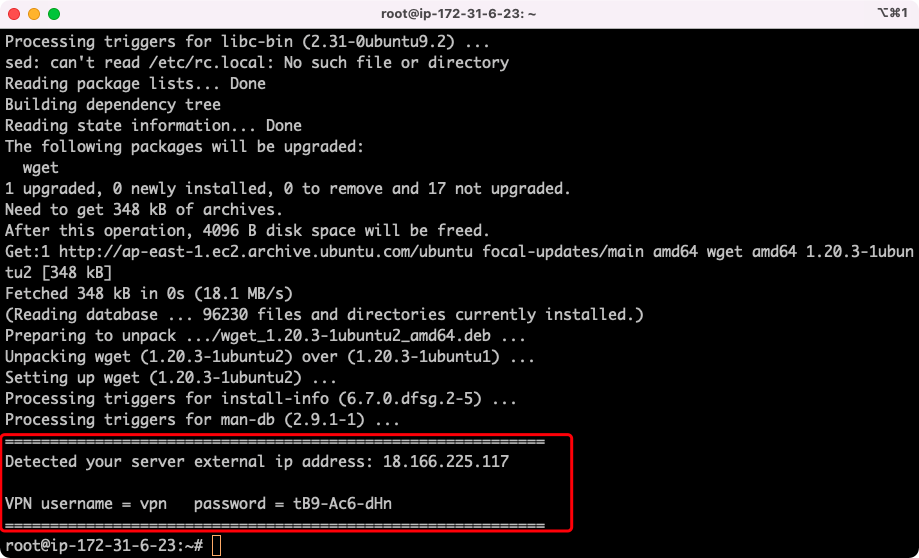

# 方法一演示

## 基础环境

**服务器系统**

- ubuntu 20

**开放端口**

- TCP port 22 (SSH)
- TCP port 1723

## 安装

### 脚本下载

```bash
wget https://raw.githubusercontent.com/jefferyjob/vpn-setup/bd0f3fd5b5806ca32d7c5708a08368939b4786a5/pptp/1/pptp.sh?token=AF4V32Z54MHXGPRUVXM5RKDBWHQTW
```

### 进行安装

```bash
sudo sh setup.sh
```

### 安装完成

安装完成后，可以在完成界面看到账户名称和密码等信息。

